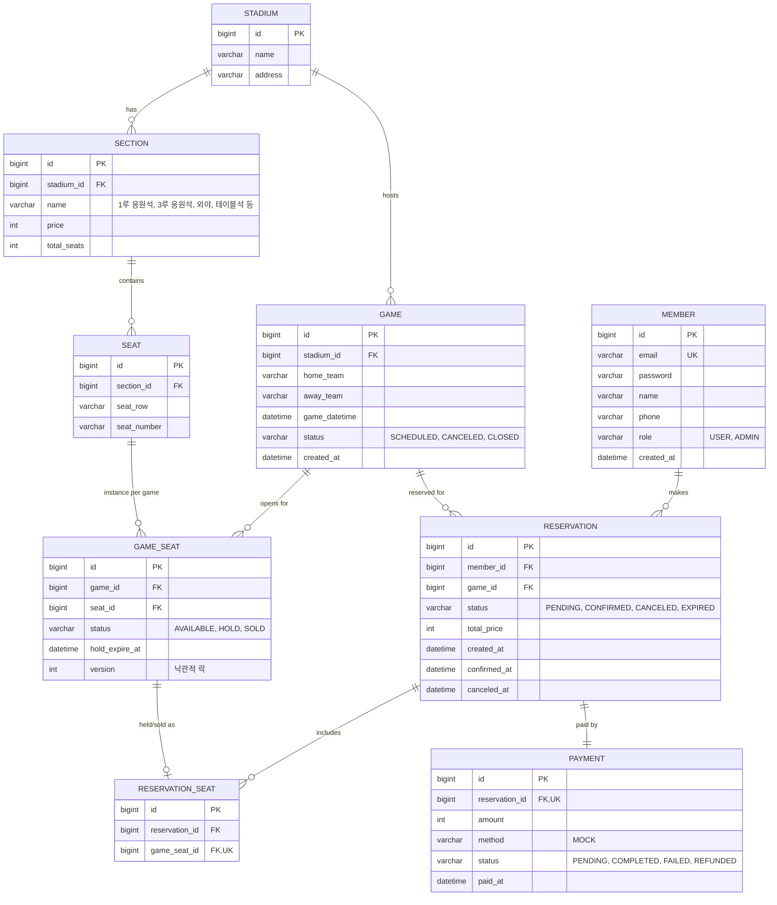

# ERD — 야구 좌석예매 시스템

## 설계 원칙

이 프로젝트의 핵심 과제는 **동일 좌석에 대한 동시 예매 요청을 안전하게 처리하는 것**이다. 이를 구조적으로 뒷받침하기 위해 두 가지 설계를 채택했다.

1. **물리적 좌석(`seat`, 정적)과 경기별 좌석 상태(`game_seat`, 동적)를 분리한다.**
   `seat`는 구장에 고정된 좌석 배치(구역, 열, 번호)만 나타내고, 경기마다 달라지는 판매 상태(AVAILABLE/HOLD/SOLD)는 `game_seat`가 담당한다. 동시성 제어(락)는 `game_seat` 행 단위로 걸린다 — 좌석 자체가 아니라 "이번 경기의 이 좌석 상태"를 잠그는 것이 핵심이다.
2. **가격은 좌석이 아니라 구역(`section`) 단위로 고정한다.** 경기별 변동가는 다루지 않는다(1차 스코프 제외).

## ER Diagram

## 테이블 상세

### member
| 컬럼 | 타입 | 제약 | 설명 |
|---|---|---|---|
| id | BIGINT | PK, AUTO_INCREMENT | |
| email | VARCHAR(255) | UNIQUE, NOT NULL | 로그인 ID |
| password | VARCHAR(255) | NOT NULL | 암호화 저장 |
| name | VARCHAR(50) | NOT NULL | |
| phone | VARCHAR(20) | | |
| role | VARCHAR(20) | NOT NULL, DEFAULT 'USER' | USER / ADMIN |
| created_at | DATETIME | NOT NULL | |

### stadium
| 컬럼 | 타입 | 제약 | 설명 |
|---|---|---|---|
| id | BIGINT | PK | |
| name | VARCHAR(100) | NOT NULL | 단일 구장 — seed 1 row |
| address | VARCHAR(255) | | |

### section (구역)
| 컬럼 | 타입 | 제약 | 설명 |
|---|---|---|---|
| id | BIGINT | PK | |
| stadium_id | BIGINT | FK → stadium.id | |
| name | VARCHAR(50) | NOT NULL | 1루 응원석 / 3루 응원석 / 외야 / 테이블석 등 |
| price | INT | NOT NULL | 구역 고정가 |
| total_seats | INT | NOT NULL | |

### seat (물리적 좌석 — 정적)
| 컬럼 | 타입 | 제약 | 설명 |
|---|---|---|---|
| id | BIGINT | PK | |
| section_id | BIGINT | FK → section.id | |
| seat_row | VARCHAR(10) | NOT NULL | |
| seat_number | VARCHAR(10) | NOT NULL | |
| | | UNIQUE(section_id, seat_row, seat_number) | |

### game
| 컬럼 | 타입 | 제약 | 설명 |
|---|---|---|---|
| id | BIGINT | PK | |
| stadium_id | BIGINT | FK → stadium.id | |
| home_team | VARCHAR(50) | NOT NULL | |
| away_team | VARCHAR(50) | NOT NULL | |
| game_datetime | DATETIME | NOT NULL | |
| status | VARCHAR(20) | NOT NULL | SCHEDULED / CANCELED / CLOSED |
| created_at | DATETIME | NOT NULL | |

### game_seat (경기별 좌석 상태 — 동적, 동시성 제어 핵심 테이블)
| 컬럼 | 타입 | 제약 | 설명 |
|---|---|---|---|
| id | BIGINT | PK | |
| game_id | BIGINT | FK → game.id | |
| seat_id | BIGINT | FK → seat.id | |
| status | VARCHAR(20) | NOT NULL, DEFAULT 'AVAILABLE' | AVAILABLE / HOLD / SOLD |
| hold_expire_at | DATETIME | NULL | HOLD 상태일 때만 값 존재, TTL 5분 |
| version | INT | NOT NULL, DEFAULT 0 | 낙관적 락(@Version) |
| | | UNIQUE(game_id, seat_id) | 경기당 좌석 인스턴스 1개 보장 |

> `admin`이 경기를 등록하면 `POST /api/admin/games/{gameId}/seats/init`으로 해당 구장의 모든 `seat`에 대응하는 `game_seat` row를 AVAILABLE 상태로 일괄 생성한다.
> 만료된 HOLD는 스케줄러가 주기적으로 스캔해 AVAILABLE로 되돌린다(4주차 구현).

### reservation
| 컬럼 | 타입 | 제약 | 설명 |
|---|---|---|---|
| id | BIGINT | PK | |
| member_id | BIGINT | FK → member.id | |
| game_id | BIGINT | FK → game.id | |
| status | VARCHAR(20) | NOT NULL | PENDING / CONFIRMED / CANCELED / EXPIRED |
| total_price | INT | NOT NULL | |
| created_at | DATETIME | NOT NULL | |
| confirmed_at | DATETIME | NULL | |
| canceled_at | DATETIME | NULL | |

### reservation_seat (예매-좌석 매핑, N:M 해소)
| 컬럼 | 타입 | 제약 | 설명 |
|---|---|---|---|
| id | BIGINT | PK | |
| reservation_id | BIGINT | FK → reservation.id | |
| game_seat_id | BIGINT | FK → game_seat.id, UNIQUE | 활성 예매 기준 좌석 중복 배정 방지 |

### payment
| 컬럼 | 타입 | 제약 | 설명 |
|---|---|---|---|
| id | BIGINT | PK | |
| reservation_id | BIGINT | FK → reservation.id, UNIQUE | 예매 1건당 결제 1건 |
| amount | INT | NOT NULL | |
| method | VARCHAR(20) | NOT NULL | MOCK (실PG 미연동, 1차 스코프) |
| status | VARCHAR(20) | NOT NULL | PENDING / COMPLETED / FAILED / REFUNDED |
| paid_at | DATETIME | NULL | |
